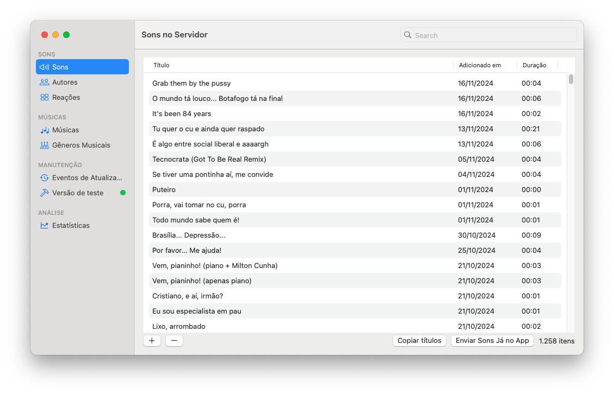

# MedoHelper

This is an internal tool for managing all server aspects of to the [Medo e Delírio iOS project](https://github.com/rafaelclaycon/MedoDelirioBrasilia).

🌟 Star this repo! ↗️

🐙 [Sponsor me](https://github.com/sponsors/rafaelclaycon) so I can keep making cool stuff!

Prefer to do it in Reais? [Here you go](https://apoia.se/app-medo-delirio-ios).

## Features

1. Feed content to a custom-built sync system built on 100% Apple-native technologies.
1. Update content details after publishing.
1. Update content files after publishing.

## How to run this project

To build and run this project, you'll need:

- A Mac running macOS 14.2 Sonoma or later;
- Xcode 15.2 or later;
- a local or remote instance of the [medo-delirio-api](https://github.com/rafaelclaycon/medo-delirio-api) running and set up on the `MedoHelperApp.swift` file.

That's it.

## About this repo

Rafael C. Schmitt – [@mitt_rafael@toot.wales](https://toot.wales/@mitt_rafael)

Distributed under the MIT license. See ``LICENSE`` for more information.
